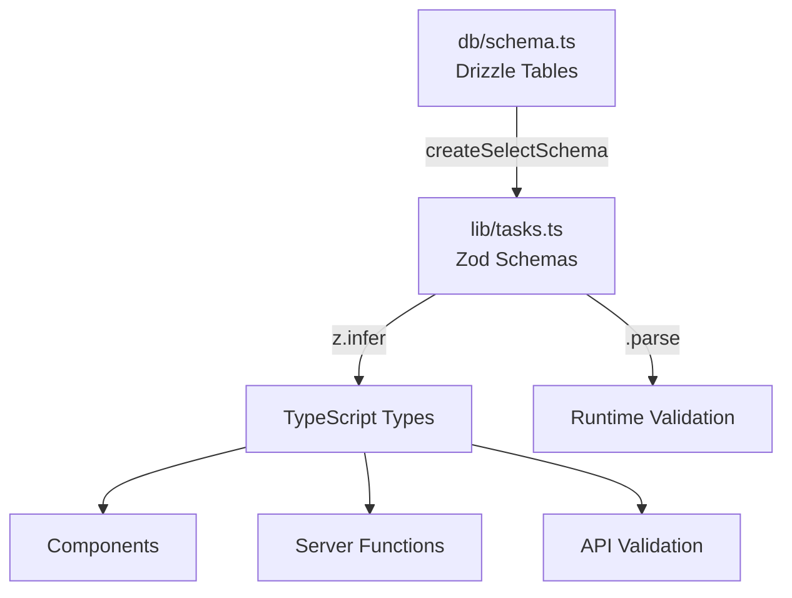

# TypeScript Type System

This project uses a **single source of truth** pattern for types, ensuring type safety across the entire application with automatic synchronization between database schemas, runtime validation, and TypeScript types.

## Architecture: Single Source of Truth



**Flow**: Database Schema → Zod Schemas → TypeScript Types → Application Code

## Where Types Are Defined

### Primary Type Definitions

- **`src/lib/tasks.ts`** - Main type definitions and schemas
  - Base schemas (generated from Drizzle)
  - Composed schemas (with relations)
  - TypeScript types (derived from Zod)
  - Input validation schemas

- **`src/db/schema.ts`** - Database schema (source of truth)
  - Drizzle table definitions
  - Enum types (`Priority`, `RecurrenceType`)

## Type System Layers

### 1. Database Schema (Source of Truth)

```typescript
// src/db/schema.ts
export const todos = pgTable('todos', {
  id: uuid('id').primaryKey().defaultRandom(),
  name: text('name').notNull(),
  priority: priorityEnum('priority').notNull().default('low'),
  // ...
})
```

### 2. Zod Schemas (Generated from Database)

```typescript
// src/lib/tasks.ts
import { createSelectSchema } from 'drizzle-zod'

// Base schemas - auto-generated from Drizzle tables
export const todoSchema = createSelectSchema(todos)
export const listSchema = createSelectSchema(lists)

// Composed schemas - built on top of base schemas
export const todoWithRelationsSchema = todoSchema.extend({
  list: listSchema.nullable().optional(),
  subtasks: z.array(subtaskSchema).optional(),
})
```

### 3. TypeScript Types (Derived from Zod)

```typescript
// Types inferred from Zod schemas
export type Todo = z.infer<typeof todoSchema>
export type TodoWithRelations = z.infer<typeof todoWithRelationsSchema>
export type ListWithCount = z.infer<typeof listWithCountSchema>
```

## Key Types

### Core Entity Types

- **`Todo`** - Base todo entity (from `todoSchema`)
- **`List`** - List entity (from `listSchema`)
- **`Subtask`** - Simple subtask entity (from `subtaskSchema`) - name and completion status only

### Relation Types

- **`TodoWithRelations`** - Todo with list and subtasks
- **`ListWithCount`** - List with todo count for UI

### Input Types

- **`CreateTodoInput`** - Input for creating todos
- **`UpdateTodoInput`** - Input for updating todos
- **`CreateSubtaskInput`** - Input for creating subtasks (just a name and todoId)
- **`UpdateSubtaskInput`** - Input for updating subtasks
- **`CreateListInput`** - Input for creating lists
- **`UpdateListInput`** - Input for updating lists

### Enum Types

- **`Priority`** - Task priority levels: `'low' | 'medium' | 'high' | 'urgent' | 'critical'`
- **`RecurrenceType`** - Recurrence patterns: `'daily' | 'weekly' | 'monthly' | 'annually' | 'custom'`

## Best Practices

### 1. Always Import Types from `lib/tasks.ts`

```typescript
// ✅ Good - Single source of truth
import type { TodoWithRelations, ListWithCount } from '../../lib/tasks'

// ❌ Bad - Don't create duplicate type definitions
type TodoWithRelations = { ... } // Don't do this
```

### 2. Use Zod Schemas for Runtime Validation

```typescript
// ✅ Good - Validate with schema
import { todoWithRelationsSchema } from '../../lib/tasks'
const validated = todoWithRelationsSchema.parse(apiResponse)

// ❌ Bad - Type assertions without validation
const todo = apiResponse as TodoWithRelations // Unsafe!
```

### 3. Derive Types from Schemas, Not Manual Definitions

```typescript
// ✅ Good - Type derived from schema
export type TodoWithRelations = z.infer<typeof todoWithRelationsSchema>

// ❌ Bad - Manual type definition (gets out of sync)
export type TodoWithRelations = {
  id: string
  name: string
  // ... manual definition
}
```

### 4. Use Input Schemas for Mutations

```typescript
// ✅ Good - Use predefined input schemas
import { createTodoSchema, type CreateTodoInput } from '../../lib/tasks'

const input: CreateTodoInput = {
  name: 'New Task',
  priority: 'high',
  // ...
}
```

## Adding New Types

### Step 1: Update Database Schema

```typescript
// src/db/schema.ts
export const newTable = pgTable('new_table', {
  id: uuid('id').primaryKey().defaultRandom(),
  name: text('name').notNull(),
  // ...
})
```

### Step 2: Generate Zod Schema

```typescript
// src/lib/tasks.ts
export const newTableSchema = createSelectSchema(newTable)
```

### Step 3: Derive TypeScript Type

```typescript
// src/lib/tasks.ts
export type NewTable = z.infer<typeof newTableSchema>
```

### Step 4: Export and Use

```typescript
// Components can now import and use
import type { NewTable } from '../../lib/tasks'
```

## Type Safety Patterns

### Server Function Return Types

Server functions return data from database queries. Use Zod schemas to validate:

```typescript
// src/lib/server/ai.ts
import { todoWithRelationsSchema } from '../tasks'

const result = await db.query.todos.findFirst({ ... })
return todoWithRelationsSchema.parse(result) // Validates and types
```

### Component Props

Always type component props with exported types:

```typescript
// src/components/todos/todo-card.tsx
import type { TodoWithRelations } from '../../lib/tasks'

interface TodoCardProps {
  todo: TodoWithRelations
  onEdit: (todo: TodoWithRelations) => void
}
```

### Mutation Functions

Use input types for mutations:

```typescript
// src/components/todos/todo-dialog.tsx
import { createTodoSchema, type CreateTodoInput } from '../../lib/tasks'

const mutation = useMutation({
  mutationFn: async (input: CreateTodoInput) => {
    return createTodo({ data: input })
  },
})
```

## Runtime Validation

Zod schemas provide runtime validation in addition to compile-time types:

```typescript
// Validate API responses
const todo = todoWithRelationsSchema.parse(apiResponse)

// Validate user input
const input = createTodoSchema.parse(formData)

// Safe parsing with error handling
const result = todoWithRelationsSchema.safeParse(data)
if (result.success) {
  // result.data is typed as TodoWithRelations
} else {
  // result.error contains validation errors
}
```

## Benefits of This Approach

1. **Single Source of Truth** - Database schema is the only place to define structure
2. **Automatic Sync** - Types stay in sync with database automatically
3. **Runtime Safety** - Zod validation catches type mismatches at runtime
4. **Type Inference** - TypeScript infers types from schemas automatically
5. **Refactoring Safety** - Changes to schema propagate to all usages
6. **No Duplication** - Types defined once, used everywhere

## Common Patterns

### Type Guards

```typescript
import { todoWithRelationsSchema } from '../../lib/tasks'

function isTodoWithRelations(value: unknown): value is TodoWithRelations {
  return todoWithRelationsSchema.safeParse(value).success
}
```

### Partial Types

```typescript
// For updates, use Partial utility type
type PartialTodo = Partial<Todo>

// Or use the update schema
import { updateTodoSchema, type UpdateTodoInput } from '../../lib/tasks'
```

### Array Types

```typescript
// Arrays of types
type TodoList = TodoWithRelations[]
// or
const todos: TodoWithRelations[] = []
```

## Troubleshooting

### Type Errors After Schema Changes

1. Check that Zod schema was regenerated: `createSelectSchema(table)`
2. Verify type is derived: `z.infer<typeof schema>`
3. Restart TypeScript server in IDE
4. Run `pnpm tsc --noEmit` to check for errors

### Import Errors

- Always import from `lib/tasks.ts` for entity types
- Check that the type is exported
- Verify the import path is correct

### Validation Errors

- Check that Zod schema matches database schema
- Verify field names match exactly
- Check for nullable vs optional differences

## Related Documentation

- [Architecture Overview](./architecture-overview.md)
- [Database Schema](../db/schema.ts) - Source of truth for types
